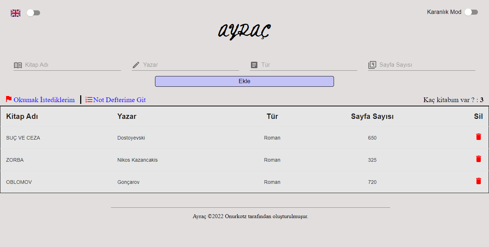
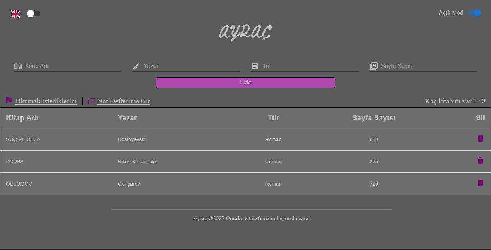
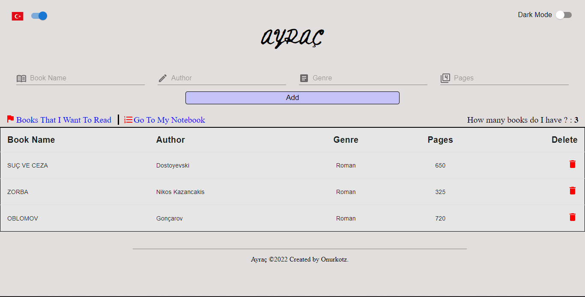
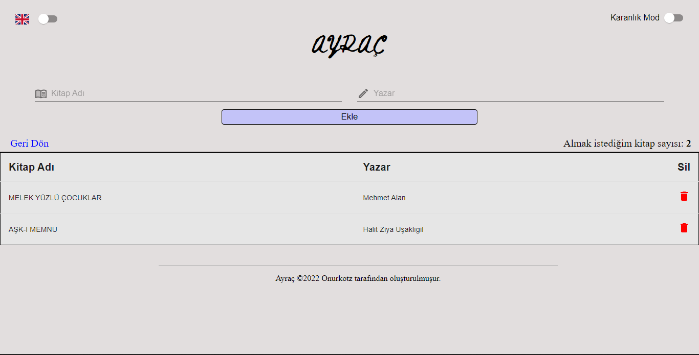
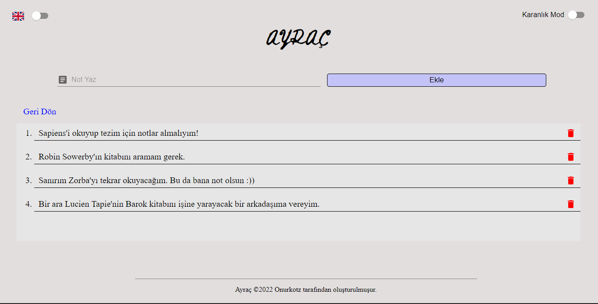
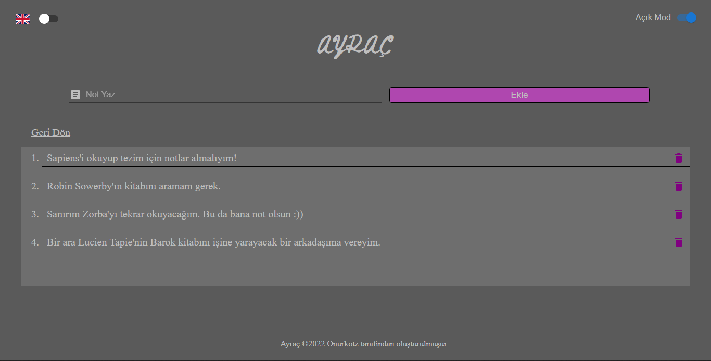

## **Ayraç** Kütüphane Uygulaması   ||   **Ayraç** Library App

---

### Kullanım || Usage

Bu uygulama ile elinizdeki kitapların bir listesini tutabilirsiniz. “Okumak İstediklerim” linkine tıklayarak da okumayı hedeflediğiniz kitapların da bir listesini oluştuırabilirsiniz. “Not Defterime Git” ile de notlarınızı basitçe yazabilirsiniz.

Bu uygulama için Açık-Karanlık Mod ve Türkçe-İngilizce desteği vardır. İstediğiniz şekilde kullanabilirsiniz.

Girdilerin ve butonların üzerine geldiğinizde sizi sevimli bir kalem ve kiltaplar karşılayacak.

\-

You can create a booklist with the books you have. By clicking the “I Want To Read” link, you can create a target list. With the “Go To My Notebook” link, you can write some notes.

This app has Light-Dark Mode and Turkish-English language support. You can use whatever you want.

When you hover over the inputs and buttons, a cute pen and books will meet you.

---

### Açık ve Karanlık Mod İçin Örnek Ekran Alıntıları   ||   Example Screenshots For Light and Dark Mode

**Açık Mod   ||   Light Mode**



**Karanlık Mod   ||   Dark Mode**


---

### İngilizce Dil Desteği İçin Örnek Ekran Alıntısı   ||   Example Screenshot For English Language Support

**İngilizce   ||   English**



---

### Hedef Kitap Listesi ve Not Defteri İçin Örnek Ekran Görüntüleri   ||   Example Screenshots For Target Book List and  Notebook

**Hedef Kitap Listesi   ||   Target Book List**



**Not Defteri Açık Mod   ||   Notebook Ligth Mode**

****

**Not Defteri Karanlık Mod   ||   Notebook Dark Mode**


---

### THIS IS A REACT APP.

---

### Geliştirme Materyalleri   ||   Development Materials

Bu uygulama geliştirilirken React JS kütüphanesi kullanılmıştır.

\-

Whlile this app developed React JS was used.

```plaintext
npx create-react-app ayrac
```

Girdiler, butonlar ve listeler için isle Material UI ve Bootstrap kullanıldı.

\-

Material UI and Bootstrap was used for the inputs, buttons and lists.

```plaintext
npm install @mui/material @emotion/react @emotion/styled
npm install bootstrap
```

State yönetimi için de Redux kullanımıştır.

\-

Redux for state management.

```plaintext
npm install @reduxjs/toolkit
npm install react-redux
```

Route yapısı için React-Router-Dom v6 kullanıldı.

\-

React-Router-Dom v6 for Route structure.

```plaintext
npm install react-router-dom
```

Açık ve Karanlık Mod için bir yazı yazmak yerine düğmenin yanına bayraklar yerleştirildi. Bunun için de danalloway tarafından oluşturulan react-country-flag kütüphanesi kuruldu.

\-

Country flags have been placed next to the switch instead of text for Light and Dark Mode. For this react-country-flag library that created by danalloway has been installed.

```plaintext
npm i react-country-flag
```

---

#### Bu uygulama içinde güncellemeler ve yeni özellikler üzerinde çalışılmaktadır.

#### \-

#### Working on updates and new features for this app.

---

## THIS APPLICATION HAS A MIT LICENSE.

### ©2022 Created by Onurkotz
